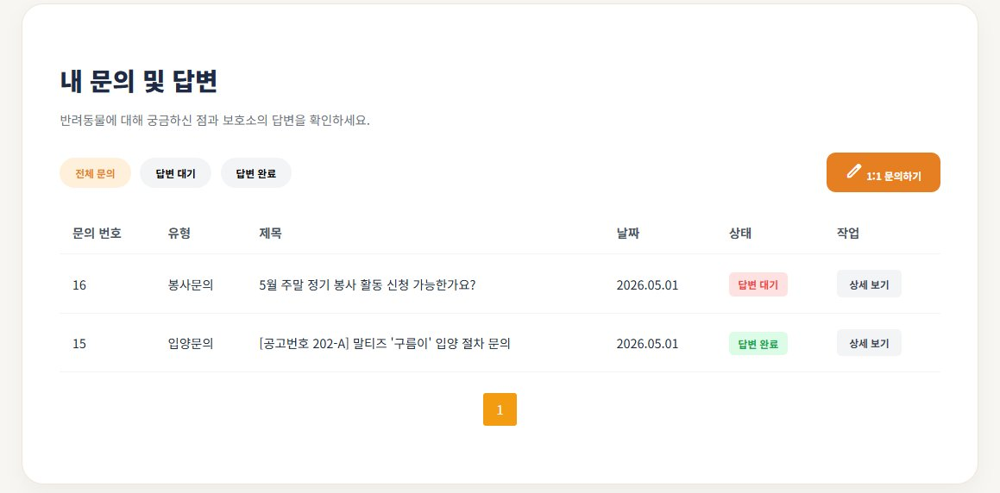
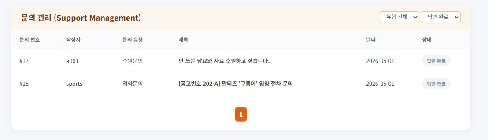
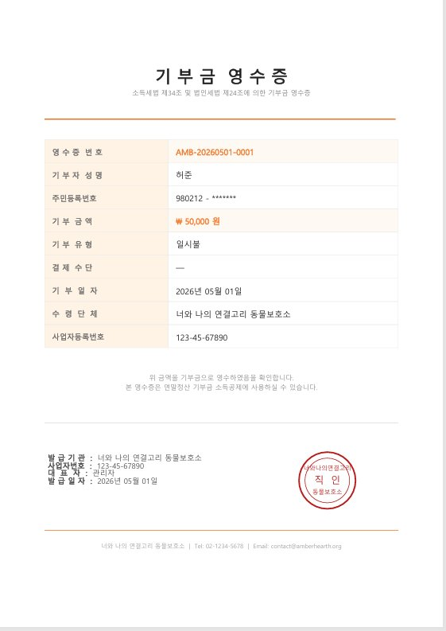
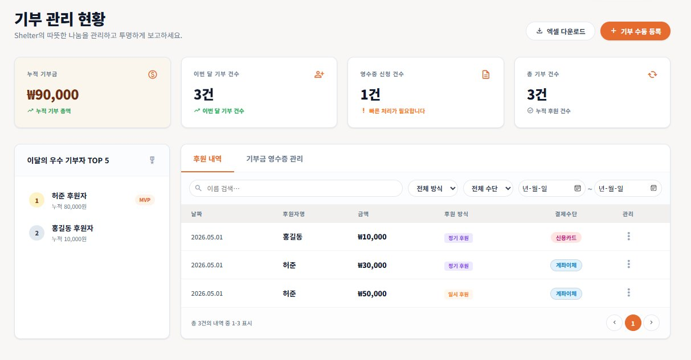
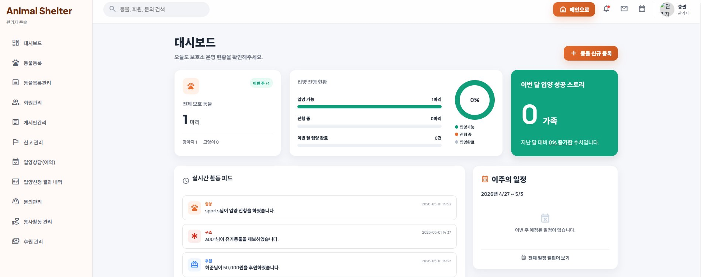
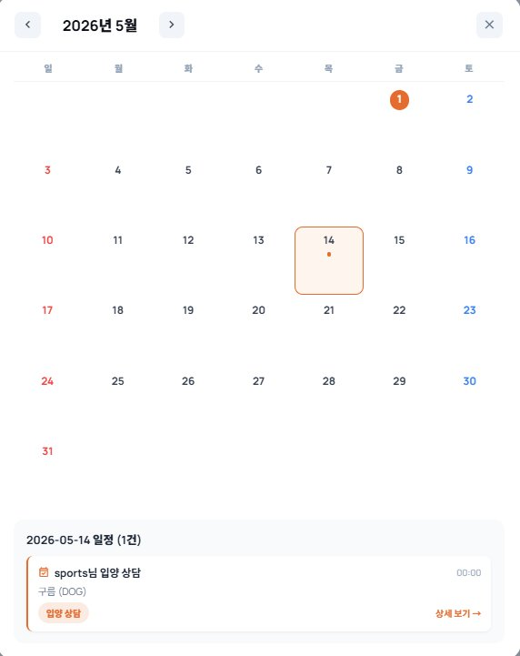

# 너와 나의 연결고리 — 유기동물 보호소 통합 웹 서비스

> 유기동물 보호소 운영을 위한 통합 웹 플랫폼.
> 입양 신청, 봉사 모집, 후원 시스템, 1:1 문의, 관리자 대시보드를 한 곳에 묶었습니다.


---

## 프로젝트 개요

| 항목 | 내용 |
|---|---|
| **기간** | 2026.03.20 ~ 2026.04.07 (약 3주) |
| **팀 구성** | 5인 팀 프로젝트 |
| **데이터베이스** | Oracle 21c XE (총 24개 테이블) |
| **협업 도구** | SVN 형상관리 · Redmine 이슈 트래킹 |
| **소속** | 대덕인재개발원 2025년 15기 · 전자정부 프레임워크 & React(AWS) 기반 풀-스택 개발자 양성과정 |

---

## 본인 담당 영역 (신청림)

> 본 저장소는 5인 팀 프로젝트의 결과물이며, 본 README는 신청림이 **단독 담당한 영역**을 중심으로 정리한 것입니다.

`support` · `donation` · `admin/main` 도메인을 단독으로 담당했습니다. **약 2,000줄** (Java + MyBatis Mapper).

### 1. 1:1 문의 시스템 (사용자/관리자)
`src/main/java/kr/or/ddit/support/`

- 등록 · 수정 · 삭제 · 목록 조회 컨트롤러 분리 구현
- `PageVO` + `PageUtil` 기반 서버사이드 페이징
- 상태 필터 (답변 대기 / 완료) + 관리자용 유형 필터 (입양 · 봉사 · 일반)
- `SUPPORT_FILE` 테이블 분리 설계로 이미지 첨부 기능
- 관리자 답변 저장 시 문의 STATUS 자동 갱신

### 2. 후원 시스템 + 기부금 영수증 PDF
`src/main/java/kr/or/ddit/donation/`

- 최소 1,000원 유효성 검사, 후원 성공 시 회원 `IS_DONOR` 컬럼 즉시 갱신
- **AES 암호화 직접 구현** (`AESUtil.java`) — 기부자 주민번호 암호화 저장
- **iText로 A4 PDF 자동 생성** (`DonationReceiptDownload.java`)
  - 한글 폰트(맑은고딕) BaseFont 직접 임베드
  - 직인 도장을 `PdfTemplate`으로 코드로 직접 구현 (외부 이미지 없음)
- 관리자 후원 목록: 날짜·금액·유형 필터 + 우수 기부자 TOP 5 랭킹

### 3. 관리자 대시보드 메인
`src/main/java/kr/or/ddit/admin/controller/AdminMainpage.java`

- 동물 현황 통계 (전체 · 견종별 · 신규 · 입양 상태별)
- **`UNION ALL` 기반 통합 일정 SQL** — 입양·봉사 별도 테이블을 한 캘린더로 표현 (`resources/mapper/Admin.xml`)
- 유형별 동적 URL 생성 (입양·봉사·모집 → switch문)
- 실시간 활동 피드 (입양 · 봉사 · 후원)

---

## 기술 스택

| 분류 | 사용 기술 |
|---|---|
| **언어** | Java 21 (Jakarta EE Servlet) |
| **백엔드** | Servlet · MyBatis 3.5.14 |
| **DB** | Oracle 21c XE · SQL Developer |
| **프론트엔드** | JSP · HTML5 · CSS3 · JavaScript |
| **보안** | AES 암호화 (직접 구현) · BCrypt |
| **라이브러리** | iText (PDF) · Apache POI · Chart.js · Leaflet.js · JavaMail (SMTP) |
| **외부 API** | Daum 주소 API |
| **개발 환경** | Eclipse 2024-09-R · Apache Tomcat 10.1 |
| **협업** | SVN 형상관리 · Redmine |

---

## 화면

### 1:1 문의 시스템
| 사용자 — 문의 목록 | 관리자 — 문의 관리 |
|---|---|
|  |  |

### 후원 시스템
| 기부금 영수증 PDF | 관리자 기부 관리 |
|---|---|
|  |  |

### 관리자 대시보드
| 메인 대시보드 | 통합 일정 캘린더 |
|---|---|
|  |  |

---

## 실행 방법

### 사전 준비

- JDK 21 이상
- Apache Tomcat 10.1
- Oracle 21c XE
- Eclipse 2024-09 + EGit (또는 IntelliJ)

### 설정 파일 작성

`resources/config/db.properties.example` 파일을 같은 위치에 `db.properties`로 복사한 뒤 본인의 DB 정보를 입력합니다.

```properties
driver=oracle.jdbc.driver.OracleDriver
url=jdbc:oracle:thin:@your_db_host:1521:xe
username=YOUR_DB_USER
password=YOUR_DB_PASSWORD
```

`src/main/java/kr/or/ddit/util/MailUtil.java` 의 다음 두 줄도 본인 계정으로 교체하세요.

```java
final String from = "YOUR_EMAIL@gmail.com";
final String password = "YOUR_APP_PASSWORD";  // Gmail 앱 비밀번호
```

> 보안상 실제 비밀번호는 `.gitignore`로 저장소에서 제외되어 있습니다.

### 빌드 & 실행

1. Eclipse에서 **Import → Existing Projects into Workspace** 로 가져오기
2. 프로젝트 우클릭 → **Properties → Java Build Path → Libraries** 탭에서 `src/main/webapp/WEB-INF/lib` 안의 jar 파일들이 인식되는지 확인
3. Tomcat 10.1 서버에 추가 → Run on Server
4. 브라우저에서 `http://localhost:8080/Animal_Shelter/main.do` 접속

---

## 프로젝트 구조 (담당 영역 기준)

```
src/main/java/kr/or/ddit/
├── admin/
│   ├── controller/AdminMainpage.java   ⭐ 본인 담당 — 대시보드 메인
│   └── ...
├── donation/                            ⭐ 본인 담당 — 후원 도메인 전체
│   ├── controller/
│   │   ├── DonationForm.java
│   │   ├── DonationInsert.java
│   │   └── DonationReceiptDownload.java  (iText PDF 생성)
│   ├── dao/
│   ├── service/
│   └── vo/
│       ├── AESUtil.java                  (AES 암호화 직접 구현)
│       └── DonationVO.java
└── support/                             ⭐ 본인 담당 — 1:1 문의 도메인 전체
    ├── controller/  (CRUD 컨트롤러 분리)
    ├── dao/
    ├── service/
    └── vo/

resources/
├── config/
│   ├── MyBatisConfig.xml
│   └── db.properties.example            (실제 db.properties는 .gitignore로 제외)
└── mapper/
    ├── Admin.xml                        ⭐ UNION ALL 통합 일정 SQL
    ├── Donation.xml                     ⭐ 본인 담당
    └── Support.xml                      ⭐ 본인 담당
```

---

## 어려웠던 점 & 해결 방법

| 문제 상황 | 해결 방법 |
|---|---|
| 1:1 문의 페이징 이동 시 필터(상태값) 초기화 | `PageVO`에 상태·유형 필드 추가, MyBatis 동적 쿼리에 함께 바인딩 |
| 입양·봉사 별도 테이블을 한 캘린더로 표현 필요 | `UNION ALL`로 단일 목록 구성, switch문으로 유형별 URL 동적 생성 |
| iText 한글 미지원 + 직인 외부 이미지 없음 | 맑은고딕 `BaseFont` 직접 임베드, `PdfTemplate`으로 직인 코드 구현 |
| 관리자 답변 후 사용자 측 상태 미반영 | 답변 저장 트랜잭션에 STATUS 자동 업데이트 통합 |

---

## 학습 포인트 & 향후 개선

### 배운 것
- MVC 패턴 — Controller → Service → DAO → Mapper 흐름 체득
- 보안 처리 — AES 암호화, BCrypt 해시 직접 구현
- SQL 쿼리 — UNION ALL, 동적 쿼리, 서버사이드 페이징
- 문서 생성 — iText로 한글 PDF 직접 임베드
- 팀 협업 — SVN 형상관리, Redmine 이슈 트래킹, 5인 역할 분담

---

## 라이선스 / 사용

본 저장소는 학원 팀 프로젝트의 학습 목적 결과물입니다. 코드 열람·참고는 자유이며 상업적 이용은 권장하지 않습니다.
프로젝트 내 사용된 폰트는 Microsoft 맑은고딕(Windows 시스템 폰트)으로 해당 라이선스를 따릅니다.

---

## 담당자 정보

**신청림 (Shin Cheongrim)** — Java Backend Developer

- GitHub: [@cheongrim-shin](https://github.com/cheongrim-shin)
- Email: dribble037@gmail.com
- 소속: 대덕인재개발원 2025년 15기 · 전자정부 프레임워크 & React(AWS) 기반 풀-스택 개발자 양성과정
